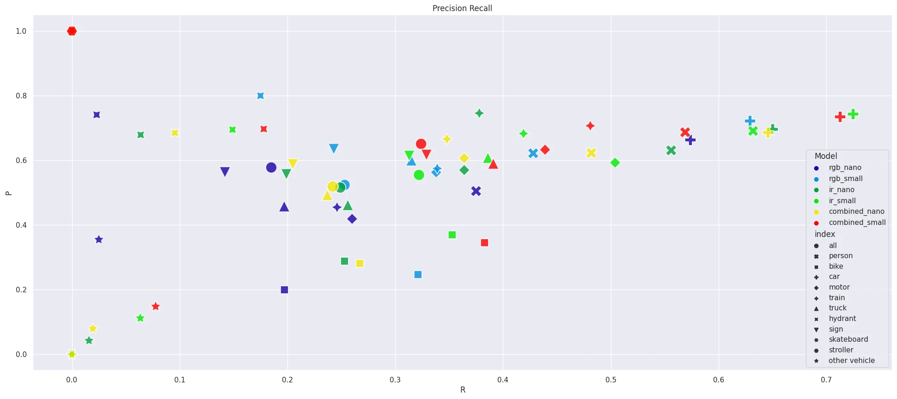

# YOLOv8 Nightshift

> __Question__: Does it make sense to deploy two image classification / object detection models to handle Day (RGB) / Night (IR) cameras? Is there a penalty for combining day and night footage into one big dataset?

## Dataset

> [Teledyne FLIR Free ADAS Thermal Dataset v2](https://adas-dataset-v2.flirconservator.com/#multipartdownloadsection):
> The Teledyne FLIR free starter thermal dataset provides fully annotated thermal and visible spectrum frames for development of object detection neural networks. This data was constructed to encourage research on visible + thermal spectrum sensor fusion algorithms ("RGBT") in order to advance the safety of autonomous vehicles. A total of 26,442 fully-annotated frames are included with 15 different object classes.

### Labels

A modified MSCOCO label map was used with conventions that were largely inspired by the Berkeley Deep Drive dataset. The following classes are included:

* __Category Id 1__: `person`
* __Category Id 2__: `bike` (renamed from "bicycle")
* __Category Id 3__: `car` (this includes pick-up trucks and vans)
* __Category Id 4__: `motor` (renamed from "motorcycle" for brevity)
* __Category Id 6__: `bus`
* __Category Id 7__: `train`
* __Category Id 8__: `truck` (semi/freight truck, excluding pickup truck)
* __Category Id 10__: `light` (renamed from "traffic light" for brevity)
* __Category Id 11__: `hydrant` (renamed "fire hydrant" for brevity)
* __Category Id 12__: `sign` (renamed from "street sign" for brevity)
* __Category Id 17__: `dog`
* __Category Id 37__: `skateboard`
* __Category Id 73__: `stroller` (four-wheeled carriage for a child, also called pram)
* __Category Id 77__: `scooter`
* __Category Id 79__: `other vehicle` (less common vehicles like construction equipment and trailers)

#### Annotation Counts

| Thermal Image Annotations | | | Visible Image Annotations | | |
| -- | -- | -- | -- | -- | -- |
| Label | Train | Val | Label | Train | Val |
| `person` | 50,478 | 4,470 | `person` | 35,007 | 3,223 |
| `bike` | 7,237 | 170 | `bike` | 7,560 | 193 |
| `car` | 73,623 | 7,133 | `car` | 71,281 | 7,285 |
| `motor` | 1,116 | 55 | `motor` | 1,837 | 77 |
| `bus` | 2,245 | 179 | `bus` | 1,879 | 183 |
| `train` | 5 | 0 | `train` | 9 | 0 |
| `truck` | 829 | 46 | `truck` | 1,251 | 47 |
| `light` | 16,198 | 2,005 | `light` | 18,640 | 2,143 |
| `hydrant` | 1,095 | 94 | `hydrant` | 990 | 126 |
| `sign` | 20,770 | 2,472 | `sign` | 29,531 | 3,581 |
| `dog` | 4 | 0 | -- | -- | -- |
| `deer` | 8 | 0 | -- | -- | -- |
| `skateboard` | 29 | 3 | `skateboard` | 412 | 4 |
| `stroller` | 15 | 6 | `stroller` | 38 | 7 |
| `scooter` | 15 | 0 | `scooter` | 41 | 0 |
| `other vehicle` | 1,373 | 63 | `other vehicle` | 698 | 40 |
| __Total__ | 175,040 | 16,696 | __Total__ | 169,174 | 16,909 |

## Evaluation

I trained both a `YOLOv8n` and `YOLOv8s` model for each case - only RGB images, only IR images and for the combined image dataset. The following are the results for each model, each dataset split by classes:

__Note__ that classes that are underrepresented in the dataset perform abysmal. Personally, I only consider the following classes to be representative for the result of this experiment:

__Conclusions__:

* Given the quality of the images in this dataset it is easier to identify objects from the thermal / IR images.
* The S-Model always outperforms the N-Model - as expected. It would be interesting to extend this experiment to include the more complex M, L to X-Model variations.
* You need at least the S-Model to be able to work with the mixed (day+night) dataset. There is a penalty for a few classes. But this might not justify the added complexity of using 2 models instead.